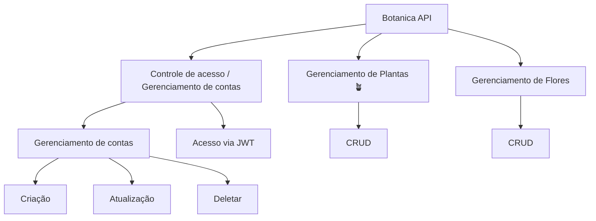
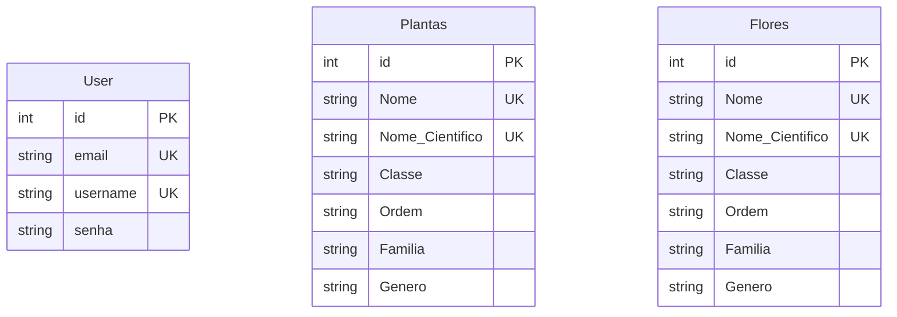

- Esse é um projeto baseado no curso [FastAPI do ZERO](https://fastapidozero.dunossauro.com) 📺


# Botanica API 🪴
<div>
    
    
    
    
</div>

<br>
Bem-vindo ao projeto Botanical API! Esta API foi criada para fornecer informações sobre algumas plantas e uma variedade de flores. É um modelo relativamente simples, com termos mais voltados a área científica. 

<br>

- [O projeto.](#o-projeto-)
- [A API.](#a-api-)
    - [Contas](#contas)
    - [Plantas e Flores](#plantas-e-flores-)
- [O banco de dados.](#o-banco-de-dados--orm)
- [Tecnologias & Ferramentas](#tecnologias--ferramentas-)

<br>

# O PROJETO. 🌿

O objetivo da API é criar e uma gerenciar algumas plantas. Tudo isso em um contexto bastante simplificado. Usando somente as funcionalidades que aprendemos no curso.

> Por que as flores estão separadas das plantas? Por que toda flor é uma planta, mas nem toda planta é uma flor! E espero posteriormente dividir em mais categorias.

A implementação é baseada em 3 pilares:



# A API. 🍃

A API é dividida em três routers 🪢:

- `Contas`: Gerenciamento de contas e de acesso à API.

- `Plantas`: Gerenciamento de plantas.

- `Flores`: Gerenciamento de plantas.

## Contas.

Este módulo fornece endpoints para gerenciar usuários no sistema, incluindo criação, leitura, atualização e exclusão de usuários. Abaixo estão os detalhes de cada endpoint disponível.

### Endpoints

### 1. Listar Usuários

**GET** `/usuarios/`

Retorna uma lista de usuários com suporte a paginação.

- **Parâmetros de Query**:
  - `limit` (int, opcional): O número máximo de usuários a serem retornados. Valor padrão: `10`.
  - `offset` (int, opcional): O número de usuários a serem ignorados antes de começar a retornar os resultados. Valor padrão: `0`.
  
- **Resposta**:
  - `200 OK`: Uma lista de usuários no formato `{ "users": [...] }`.

### 2. Criar Usuário

**POST** `/usuarios/`

Cria um novo usuário no sistema.

- **Corpo da Requisição**:
  - `UserSchema`: Esquema contendo `email`, `username` e `password` do novo usuário.

- **Resposta**:
  - `201 Created`: O usuário recém-criado no formato `UserPublic`.

- **Erros**:
  - `400 Bad Request`: Se o `username` ou `email` já existir.

### 3. Ler Usuário por ID

**GET** `/usuarios/{user_id}`

Retorna as informações de um usuário específico com base em seu ID.

- **Parâmetros de Caminho**:
  - `user_id` (int): O ID do usuário a ser recuperado.

- **Resposta**:
  - `200 OK`: Os detalhes do usuário no formato `UserPublic`.

- **Erros**:
  - `404 Not Found`: Se o usuário com o `user_id` fornecido não for encontrado.

### 4. Atualizar Usuário

**PUT** `/usuarios/{user_id}`

Atualiza as informações de um usuário existente.

- **Parâmetros de Caminho**:
  - `user_id` (int): O ID do usuário a ser atualizado.

- **Corpo da Requisição**:
  - `UserSchema`: Esquema contendo os novos valores para `email`, `username`, e `password`.

- **Resposta**:
  - `200 OK`: Os detalhes atualizados do usuário no formato `UserPublic`.

- **Erros**:
  - `404 Not Found`: Se o usuário com o `user_id` fornecido não for encontrado.
  - `401 Unauthorized`: Se o usuário autenticado não tiver permissão para atualizar o usuário.

### 5. Deletar Usuário

**DELETE** `/usuarios/{user_id}`

Deleta um usuário específico do sistema.

- **Parâmetros de Caminho**:
  - `user_id` (int): O ID do usuário a ser deletado.

- **Resposta**:
  - `200 OK`: Mensagem de confirmação da exclusão no formato `{ "message": "Usuario deletado" }`.

- **Erros**:
  - `404 Not Found`: Se o usuário com o `user_id` fornecido não for encontrado.
  - `401 Unauthorized`: Se o usuário autenticado não tiver permissão para deletar o usuário.

**AVISO ⚠️**

> O tempo de expiração do token deve ser de 30 minutos, o algorítimo usado |deve ser HS256 e o subject deve ser o email

Aqui está a documentação com as respostas esperadas em JSON, sem o formato Markdown:

<br><br>

## Plantas e Flores. 💐

### **1. Criar uma Planta**

**POST** `/plantas/`

**Descrição**: Cria uma nova planta no sistema.

**Corpo da Requisição**:
- `plantSchema`: Um objeto contendo as informações da planta (`nome`, `nome_cientifico`, `classe`, `ordem`, `familia`, `genero`).

**Resposta de Sucesso**:
```json
{
  "id": 1,
  "nome": "Rosa",
  "nome_cientifico": "Rosa spp.",
  "classe": "Magnoliopsida",
  "ordem": "Rosales",
  "familia": "Rosaceae",
  "genero": "Rosa"
}
```

**Resposta de Erro**:
- **400 Bad Request**: Se uma planta com o mesmo nome já existir.
```json
{
  "detail": "Essa planta já existe. 🍂"
}
```

---

### **2. Listar Plantas**

**GET** `/plantas/`

**Descrição**: Retorna uma lista de plantas, com suporte a paginação.

**Parâmetros de Query**:
- `limit` (int, opcional): Número máximo de plantas a serem retornadas. Valor padrão: `10`.
- `offset` (int, opcional): Número de plantas a serem ignoradas antes de começar a retornar os resultados. Valor padrão: `0`.

**Resposta de Sucesso**:
```json
{
  "Plants": [
    {
      "id": 1,
      "nome": "Rosa",
      "nome_cientifico": "Rosa spp.",
      "classe": "Magnoliopsida",
      "ordem": "Rosales",
      "familia": "Rosaceae",
      "genero": "Rosa"
    },
    {
      "id": 2,
      "nome": "Girassol",
      "nome_cientifico": "Helianthus annuus",
      "classe": "Magnoliopsida",
      "ordem": "Asterales",
      "familia": "Asteraceae",
      "genero": "Helianthus"
    }
  ]
}
```

---

### **3. Filtrar Plantas por Atributos**

**GET** `/plantas/?classe={classe}&ordem={ordem}&familia={familia}&genero={genero}`

**Descrição**: Filtra plantas com base em atributos como classe, ordem, família e gênero.

**Parâmetros de Query**:
- `classe` (str, opcional): Filtrar por classe.
- `ordem` (str, opcional): Filtrar por ordem.
- `familia` (str, opcional): Filtrar por família.
- `genero` (str, opcional): Filtrar por gênero.
- `limit` (int, opcional): Limite de resultados.
- `offset` (int, opcional): Offset de resultados.

**Resposta de Sucesso**:
```json
{
  "Plants": [
    {
      "id": 3,
      "nome": "Margarida",
      "nome_cientifico": "Bellis perennis",
      "classe": "Magnoliopsida",
      "ordem": "Asterales",
      "familia": "Asteraceae",
      "genero": "Bellis"
    }
  ]
}
```

---

### **4. Ler uma Planta Específica**

**GET** `/plantas/{plant_id}`

**Descrição**: Retorna os detalhes de uma planta específica com base em seu ID.

**Parâmetros de Caminho**:
- `plant_id` (int): ID da planta a ser recuperada.

**Resposta de Sucesso**:
```json
{
  "id": 1,
  "nome": "Rosa",
  "nome_cientifico": "Rosa spp.",
  "classe": "Magnoliopsida",
  "ordem": "Rosales",
  "familia": "Rosaceae",
  "genero": "Rosa"
}
```

**Resposta de Erro**:
- **404 Not Found**: Se a planta com o `plant_id` fornecido não for encontrada.
```json
{
  "detail": "Planta não encontrada. 🍂"
}
```

---

### **5. Atualizar uma Planta**

**PUT** `/plantas/{plant_id}`

**Descrição**: Atualiza as informações de uma planta existente.

**Parâmetros de Caminho**:
- `plant_id` (int): ID da planta a ser atualizada.

**Corpo da Requisição**:
- `plantSchema`: Objeto contendo os novos valores para a planta (`nome`, `nome_cientifico`, `classe`, `ordem`, `familia`, `genero`).

**Resposta de Sucesso**:
```json
{
  "id": 1,
  "nome": "Rosa Atualizada",
  "nome_cientifico": "Rosa spp.",
  "classe": "Magnoliopsida",
  "ordem": "Rosales",
  "familia": "Rosaceae",
  "genero": "Rosa"
}
```

**Resposta de Erro**:
- **404 Not Found**: Se a planta com o `plant_id` fornecido não for encontrada.
```json
{
  "detail": "A planta não existe, ela não foi encontrada. 🍂"
}
```

---

### **6. Deletar uma Planta**

**DELETE** `/plantas/{plant_id}`

**Descrição**: Deleta uma planta específica do sistema.

**Parâmetros de Caminho**:
- `plant_id` (int): ID da planta a ser deletada.

**Resposta de Sucesso**:
```json
{
  "message": "A planta foi deletada 🪓🪚"
}
```

**Resposta de Erro**:
- **404 Not Found**: Se a planta com o `plant_id` fornecido não for encontrada.
```json
{
  "detail": "Planta não encontrada. 🍂"
}
```

---

Isso deve ajudar a documentar a API com as respostas de JSON formatadas corretamente.


# O BANCO DE DADOS | ORM. 🌵

A modelagem do banco deve contar com três tabelas: User, Plantas e Flores.



## Extração dos dados. 🌱

Este projeto utilizou web scraping para extrair informações taxonômicas sobre plantas a partir da [Wikipédia](https://pt.wikipedia.org/wiki/Lista_de_plantas_do_Brasil). Utilizando a biblioteca `BeautifulSoup` para fazer o parsing do HTML, foram coletados dados como nome científico, classe, ordem, família e gênero de diversas plantas. Esses dados foram então armazenados em um banco de dados usando SQLAlchemy, facilitando consultas futuras e garantindo a persistência das informações extraídas.

<p align='center'>

</p>


**AVISO ⚠️**
> Muito dos dados foram retirados de forma bruta. Sem uma limpeza adequada ou verificação de fonte. Para caso exista valores quebrados ou valores irreais.  


# TECNOLOGIAS & FERRAMENTAS. 🌲


1. FastAPI

2. Pydantic


3. SQLAlchemy 


<br>

4. Coverage

5. Pytest 

<br>

5. `Hospedagem:` [Fly.io](http://Fly.io)

**AVISO ⚠️**
> Essa API ainda não passou pelo processo de Docker e da hospedagem.

# Licença

Este repositório está licenciado sob a [MIT License](./LICENSE).


---

<br>

<div style="width: 50%; height: 2px; display: flex; justify-content: center; align-items: center; margin: 0 auto;">
    <a href="https://github.com/ViniciusSilveiraCampos" target="_blank"></a>
    <a href="https://www.linkedin.com/in/vinicius-silveira-campos/" target="_blank"></a> 
    <a href="mailto:vinicius.silveira.campos@gmail.com" target="_blank"></a>
</div>

